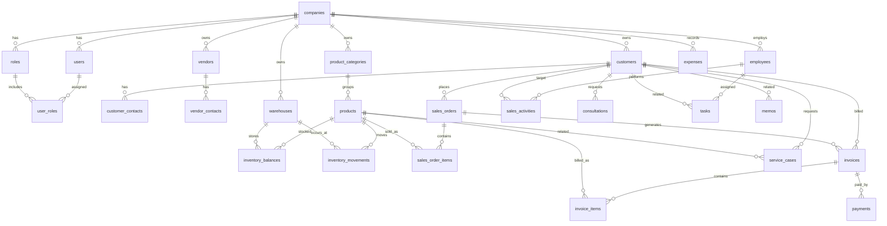

# UNIPLAN_DATA_MODEL

UniPlan AI ERP MVP용 최소 데이터 모델 초안.

목표는 easierp 전체 테이블을 복제하는 것이 아니라, 기존 easierp의 업무 개념을 참고해 **AI 질의/분석에 필요한 핵심 엔티티만 정규화**하는 것이다.

## 1. 참고한 easierp 주요 테이블

| UniPlan 영역 | easierp 참고 테이블 | 가져올 개념 |
|---|---|---|
| 회사/테넌트 | `tbcom_company` | 회사 기본정보, 사업자정보, 주소 |
| 사용자/권한 | `tbcom_user`, `tbcom_role` | 사용자, 역할, 회사 단위 권한 |
| 고객/거래처 | `tbcrm_cust_info`, `tbcrm_cust_man`, `tbcom_partner`, `tbcom_partner_worker` | 고객사, 담당자, 협력사/공급처 |
| 상품/품목 | `tbprd_product`, `tbsal_est_item`, `tbhtc_prod_cat` | 품목, 카테고리, 단가 |
| 재고 | `tbprd_stock_inout`, `tbhtc_inventory`, `tbhtc_stock_inout` | 재고 입출고, 보유수량, 창고 |
| 매출/계약 | `tbsal_sell_contract`, `tbsal_sell_contract_product`, `tbbil_taxbil`, `tbbil_taxbil_item` | 수주/계약, 매출 품목, 세금계산서 |
| 청구/미수 | `tbbil_invoice` | 청구금액, 납부금액, 잔액, 납부일 |
| 상담/AS | `tbcen_consult`, `tbsal_as_contact`, `tbsal_as_product` | 고객 상담, AS 접수/조치 |
| 직원/영업 | `tbhrm_emp`, `tbsal_sales_emp`, `tbsal_sales_activity` | 직원, 영업사원, 영업활동 |
| 업무/메모 | `tbcom_task`, `tbcom_memo`, `tbcom_todo` | 업무, 할일, 고객 관련 메모 |
| 비용/급여 | `tbfin_cost_item`, `tbfin_emp_salary` | 비용 항목, 급여 요약 |

## 2. MVP 엔티티 목록

### Core

1. `companies`
2. `users`
3. `roles`
4. `user_roles`

### CRM / Partner

5. `customers`
6. `customer_contacts`
7. `vendors`
8. `vendor_contacts`

### Product / Inventory

9. `product_categories`
10. `products`
11. `warehouses`
12. `inventory_balances`
13. `inventory_movements`

### Sales / Finance

14. `sales_orders`
15. `sales_order_items`
16. `invoices`
17. `invoice_items`
18. `payments`
19. `expenses`

### Operations

20. `employees`
21. `sales_activities`
22. `consultations`
23. `service_cases`
24. `tasks`
25. `memos`

## 3. ERD Mermaid 초안



## 4. 테이블 상세 초안

### 4.1 `companies`

회사/테넌트 기준 테이블. easierp `tbcom_company` 참고.

| 컬럼 | 타입 | 설명 |
|---|---|---|
| `id` | uuid pk | 회사 ID |
| `code` | varchar unique | 회사코드 |
| `name` | varchar | 상호 |
| `business_no` | varchar | 사업자등록번호 |
| `ceo_name` | varchar | 대표자명 |
| `business_type` | varchar | 업태 |
| `business_item` | varchar | 종목 |
| `phone` | varchar | 대표전화 |
| `email` | varchar | 대표 이메일 |
| `address1` | varchar | 기본주소 |
| `address2` | varchar | 상세주소 |
| `logo_url` | varchar | 로고 |
| `created_at` | timestamptz | 생성일 |
| `updated_at` | timestamptz | 수정일 |

### 4.2 `users`, `roles`, `user_roles`

MVP에서는 복잡한 메뉴 권한보다 `admin`, `manager`, `staff`, `viewer` 정도로 시작한다. easierp `tbcom_user`, `tbcom_role` 참고.

```text
users
- id uuid pk
- company_id uuid fk
- email varchar
- password_hash varchar
- name varchar
- phone varchar
- status varchar         -- active/inactive
- created_at timestamptz
- updated_at timestamptz

roles
- id uuid pk
- company_id uuid fk
- code varchar           -- admin/manager/staff/viewer
- name varchar

user_roles
- user_id uuid fk
- role_id uuid fk
```

### 4.3 `customers`

고객/거래처 통합 테이블. easierp `tbcrm_cust_info` 참고.

```text
customers
- id uuid pk
- company_id uuid fk
- code varchar
- name varchar
- customer_type varchar      -- company/person
- status varchar             -- active/inactive/prospect
- grade varchar
- business_no varchar
- ceo_name varchar
- business_type varchar
- business_item varchar
- phone varchar
- mobile varchar
- email varchar
- address1 varchar
- address2 varchar
- sales_owner_employee_id uuid fk nullable
- memo text
- created_at timestamptz
- updated_at timestamptz
```

### 4.4 `customer_contacts`

고객사 담당자. easierp `tbcrm_cust_man` 참고.

```text
customer_contacts
- id uuid pk
- customer_id uuid fk
- name varchar
- department varchar
- position varchar
- role varchar              -- purchase/user/accounting/etc
- phone varchar
- mobile varchar
- email varchar
- memo text
- is_retired boolean default false
- created_at timestamptz
- updated_at timestamptz
```

### 4.5 `vendors`, `vendor_contacts`

공급처/협력사. easierp `tbcom_partner`, `tbcom_partner_worker` 참고.

```text
vendors
- id uuid pk
- company_id uuid fk
- code varchar
- name varchar
- business_no varchar
- ceo_name varchar
- phone varchar
- email varchar
- address1 varchar
- address2 varchar
- bank_name varchar
- bank_account_no varchar
- bank_holder varchar
- contract_date date
- memo text

vendor_contacts
- id uuid pk
- vendor_id uuid fk
- name varchar
- department varchar
- position varchar
- phone varchar
- mobile varchar
- email varchar
- memo text
```

### 4.6 `product_categories`, `products`

품목/서비스 마스터. easierp `tbprd_product`, `tbsal_est_item`, `tbhtc_prod_cat` 참고.

```text
product_categories
- id uuid pk
- company_id uuid fk
- parent_id uuid fk nullable
- code varchar
- name varchar
- description text
- active boolean

products
- id uuid pk
- company_id uuid fk
- category_id uuid fk nullable
- code varchar
- name varchar
- product_type varchar       -- product/service/asset
- unit varchar               -- ea/box/kg/month/etc
- standard_price numeric(15,2)
- cost_price numeric(15,2)
- taxable boolean default true
- active boolean default true
- description text
- memo text
- created_at timestamptz
- updated_at timestamptz
```

### 4.7 `warehouses`, `inventory_balances`, `inventory_movements`

재고는 “현재고”와 “입출고 이력”을 분리한다. easierp `tbprd_stock_inout`, `tbhtc_inventory`, `tbhtc_stock_inout` 참고.

```text
warehouses
- id uuid pk
- company_id uuid fk
- code varchar
- name varchar
- location varchar
- active boolean

inventory_balances
- id uuid pk
- company_id uuid fk
- product_id uuid fk
- warehouse_id uuid fk
- quantity numeric(15,3)
- safety_quantity numeric(15,3)
- updated_at timestamptz

inventory_movements
- id uuid pk
- company_id uuid fk
- product_id uuid fk
- warehouse_id uuid fk
- movement_type varchar      -- in/out/adjust/transfer
- quantity numeric(15,3)
- movement_at timestamptz
- reason varchar
- ref_type varchar           -- sales_order/purchase/manual/etc
- ref_id uuid nullable
- memo text
- created_by uuid fk nullable
- created_at timestamptz
```

### 4.8 `sales_orders`, `sales_order_items`

수주/계약. easierp `tbsal_sell_contract`, `tbsal_sell_contract_product` 참고.

```text
sales_orders
- id uuid pk
- company_id uuid fk
- order_no varchar
- customer_id uuid fk
- sales_employee_id uuid fk nullable
- status varchar             -- draft/confirmed/delivered/cancelled
- order_date date
- due_date date
- delivery_date date nullable
- supply_amount numeric(15,2)
- tax_amount numeric(15,2)
- total_amount numeric(15,2)
- payment_due_date date nullable
- memo text
- created_at timestamptz
- updated_at timestamptz

sales_order_items
- id uuid pk
- sales_order_id uuid fk
- product_id uuid fk nullable
- product_name varchar
- quantity numeric(15,3)
- unit varchar
- unit_price numeric(15,2)
- supply_amount numeric(15,2)
- tax_amount numeric(15,2)
- total_amount numeric(15,2)
- memo text
```

### 4.9 `invoices`, `invoice_items`, `payments`

청구/세금계산서/미수 분석용. easierp `tbbil_invoice`, `tbbil_taxbil`, `tbbil_taxbil_item` 참고.

```text
invoices
- id uuid pk
- company_id uuid fk
- invoice_no varchar
- customer_id uuid fk
- sales_order_id uuid fk nullable
- invoice_type varchar       -- invoice/taxbill
- issue_date date
- due_date date
- status varchar             -- issued/paid/partial/overdue/cancelled
- supply_amount numeric(15,2)
- tax_amount numeric(15,2)
- total_amount numeric(15,2)
- paid_amount numeric(15,2)
- remaining_amount numeric(15,2)
- memo text
- created_at timestamptz
- updated_at timestamptz

invoice_items
- id uuid pk
- invoice_id uuid fk
- product_id uuid fk nullable
- item_name varchar
- quantity numeric(15,3)
- unit_price numeric(15,2)
- supply_amount numeric(15,2)
- tax_amount numeric(15,2)
- memo text

payments
- id uuid pk
- company_id uuid fk
- invoice_id uuid fk
- paid_at date
- amount numeric(15,2)
- method varchar             -- cash/card/bank/etc
- memo text
- created_at timestamptz
```

### 4.10 `expenses`

비용 요약 분석용. easierp `tbfin_cost_item` 참고.

```text
expenses
- id uuid pk
- company_id uuid fk
- employee_id uuid fk nullable
- expense_date date
- category varchar
- item_name varchar
- quantity numeric(15,3)
- unit_price numeric(15,2)
- amount numeric(15,2)
- payment_method varchar
- description text
- memo text
- created_at timestamptz
```

### 4.11 `employees`

직원/영업 담당자. easierp `tbhrm_emp`, `tbsal_sales_emp` 참고.

```text
employees
- id uuid pk
- company_id uuid fk
- employee_no varchar
- name varchar
- department varchar
- position varchar
- role varchar
- phone varchar
- mobile varchar
- email varchar
- employment_type varchar
- hire_date date
- resign_date date nullable
- active boolean default true
- is_sales boolean default false
- memo text
- created_at timestamptz
- updated_at timestamptz
```

### 4.12 `sales_activities`

영업 활동 분석용. easierp `tbsal_sales_activity` 참고.

```text
sales_activities
- id uuid pk
- company_id uuid fk
- employee_id uuid fk
- customer_id uuid fk nullable
- activity_type varchar       -- call/visit/email/proposal/etc
- status varchar
- started_at timestamptz
- ended_at timestamptz nullable
- location varchar
- content text
- next_action text
- created_at timestamptz
```

### 4.13 `consultations`, `service_cases`

상담/AS. easierp `tbcen_consult`, `tbsal_as_product` 참고.

```text
consultations
- id uuid pk
- company_id uuid fk
- customer_id uuid fk nullable
- contact_id uuid fk nullable
- type varchar
- status varchar              -- open/resolved/pending
- content text
- result text
- requested_contact_at timestamptz nullable
- created_at timestamptz
- updated_at timestamptz

service_cases
- id uuid pk
- company_id uuid fk
- customer_id uuid fk nullable
- product_id uuid fk nullable
- serial_no varchar nullable
- status varchar              -- received/in_progress/done/delayed
- symptom text
- action_needed text
- result text
- received_at timestamptz
- due_at timestamptz nullable
- completed_at timestamptz nullable
- memo text
```

### 4.14 `tasks`, `memos`

운영 업무/메모. easierp `tbcom_task`, `tbcom_memo`, `tbcom_todo` 참고.

```text
tasks
- id uuid pk
- company_id uuid fk
- assigned_employee_id uuid fk nullable
- customer_id uuid fk nullable
- title varchar
- content text
- status varchar              -- todo/in_progress/done/delayed
- priority varchar
- due_at timestamptz nullable
- completed_at timestamptz nullable
- progress_rate numeric(5,2)
- created_at timestamptz
- updated_at timestamptz

memos
- id uuid pk
- company_id uuid fk
- customer_id uuid fk nullable
- employee_id uuid fk nullable
- title varchar
- content text
- memo_type varchar
- created_at timestamptz
- updated_at timestamptz
```

## 5. MVP 분석 질문과 필요한 테이블

| 질문 | 필요 테이블 |
|---|---|
| 이번 달 매출 어때? | `invoices`, `sales_orders` |
| 지난달 대비 매출 증감률은? | `invoices` |
| 미수금 많은 거래처 TOP 10 | `customers`, `invoices` |
| 상품별 매출 순위 | `invoice_items`, `products` |
| 재고 부족 품목 | `inventory_balances`, `products` |
| 입출고 변동 큰 품목 | `inventory_movements`, `products` |
| 신규 고객 수 | `customers` |
| 상담 지연 건 | `consultations`, `customers` |
| AS 지연 건 | `service_cases`, `customers`, `products` |
| 영업 담당자별 실적 | `employees`, `sales_orders`, `invoices` |
| 비용 카테고리별 합계 | `expenses` |
| 오늘 사업 현황 요약 | `invoices`, `inventory_balances`, `consultations`, `service_cases`, `tasks` |

## 6. 구현 우선순위

### 1차 Seed/MVP 필수

- `companies`
- `users`, `roles`, `user_roles`
- `customers`, `customer_contacts`
- `products`, `product_categories`
- `warehouses`, `inventory_balances`, `inventory_movements`
- `sales_orders`, `sales_order_items`
- `invoices`, `invoice_items`, `payments`
- `employees`
- `consultations`, `service_cases`

### 2차로 미뤄도 되는 것

- `vendors`, `vendor_contacts`
- `expenses`
- `tasks`, `memos`
- 급여/근태 상세
- 쇼핑몰/POS/MES 상세 모듈

## 7. 설계 원칙

1. easierp의 컬럼을 그대로 복사하지 않는다.
2. `company_id` 기준 멀티테넌트 구조를 기본값으로 둔다.
3. AI 분석을 위해 날짜, 상태, 금액, 수량 컬럼은 명확히 둔다.
4. 개인정보/민감정보는 MVP에서 최소화한다.
5. 자연어 질의는 이 테이블에 직접 자유 SQL을 날리지 않고, query template/view를 통해 접근한다.
